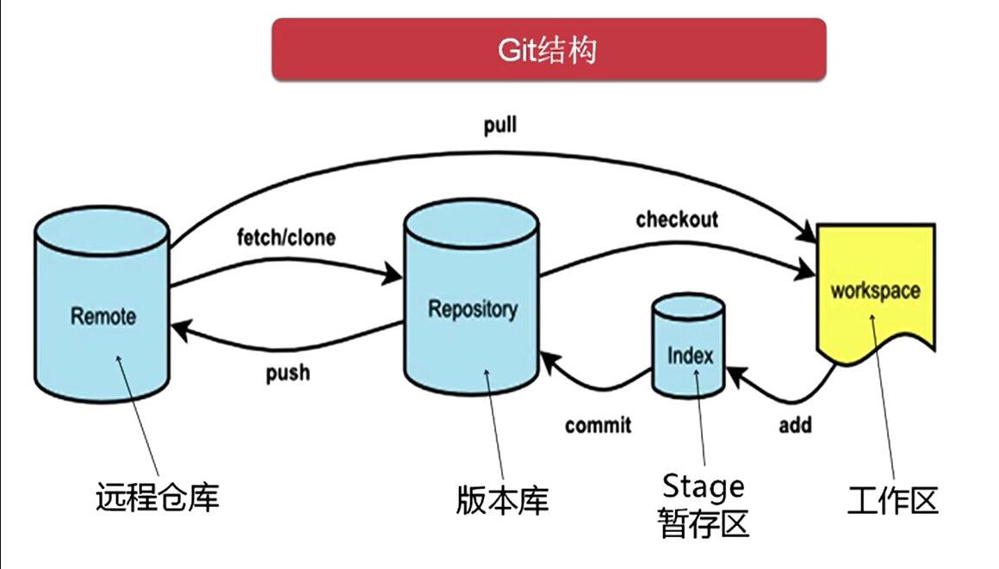

# Github学习笔记

## 学习目标

- 了解Git基本概念
- 概述Git工作流程
- 使用Git常用命令
- 熟悉Git代码托管服务
- 使用idea操作Git

## Git工作流程



## 配置Git

打开`git bash`并配置用户信息

```shell
git config --global user.name "XXX"
git config --global user.email "XXX"
```


## 本地仓库

创建本地仓库，首先在某个指定的文件夹下打开`git bash`，并输入

```shell
git init
```

将会得到如下输出

```shell
Initialized empty Git repository in C:/Users/Johnkey/OneDrive/Desktop/Johnkey/Study/learn-git/.git/
```

## Git常用指令

将文件从工作区（workspace）添加到暂存区（index）

```bash
git add .
```

将文件从暂存区（index）提交到仓库（repository）

```bash
git commit -m "XXX"
```

查看当前git的状态

```bash
git status
```

查看日志

```bash
git log [option]
```

[option]中可选的参数

- `--all`显示所有分支
- `--pretty==oneline`将提交信息显示为一行
- `--abbrev-commit`使得输出的commitID更简短
- `--graph`以图的形式显示

这条指令我们能够看到输出如下

```bash
commit 13990657169b1f85dcc85717755867139ba2ddad (HEAD -> master)
Author: Johnkey00 <1176023870@qq.com>
Date:   Sun Aug 25 09:57:12 2024 +0800

    20240825-first-commit
```

我们想使用`git log`的所有参数，但是不想每次都输入这么多内容，我们可以使用别名

在当前用户这个文件夹下（一般是C:/User/XXX）创建一个`.bashrc`文件，并在其中输入

```bash
alias git-log='git log --pretty=oneline --all --graph --abbrev-commit'
```

然后在git命令行输入`source ~/.bashrc`

这样操作之后，我们以后只需要输入`git-log`就可以看到所有参数的效果了

版本回退

```bash
git reset --hard commitId
```

有一些文件我们不想让Git来管理，这个时候如果输入`git status`指令会显示这些文件untracked，比如我有一系列`.a`格式的文件，我不想让Git管理这些文件，这个时候可以考虑加入一个新的文件名为`.gitignore`，输入指令

```bash
touch .gitignore
```

然后编辑这个文件，将不想被管理的文件名写入该文件即可，我创建了`ignore01.a`和`ignore02.a`这两个文件，接着我在`.gitignore`中输入

```bash
ignore01.a
ignore02.a
```

或者输入

```bash
*.a
```

再次输入`git status`就看不到untracked的`ignore01.a`和`ignore02.a`了

## 分支

查看分支

```bash
git branch
```

创建分支

```bash
git branch XXX
```

切换分支

```bash
git checkout XXX
```

创建并切换分支

```bash
git checkout -b XXX
```

合并分支

```bash
git merge XXX
```

删除/强制删除分支

```bash
git branch -d XXX
git branch -D XXX
```

## 解决冲突

在合并时发现如果两边同时修改了同一个地方，就会发生冲突，需要开发者来解决

首先在`master`分支下新建一个文件，命名为`conflict.txt`

```bash
touch conflict.txt
```

打开文件并输入`branch=master`

然后创建一个新的分支`branch01`

```bash
git checkout -b branch01
```

打开`conflict.txt`并将内容修改为`branch=branch01`

此时回到master分支并输入

```bash
git merge branch01
```

此时git终端将会出现如下的报错

```bash
Auto-merging conflict.txt
CONFLICT (add/add): Merge conflict in conflict.txt
Automatic merge failed; fix conflicts and then commit the result.
```

这是因为我们同时修改了两个分支下的同一部分内容，git在合并的时候不知道应该采用哪一条分支的内容作为合并后的内容，因此报错，此时打开`conflict.txt`，我们将会看到

```tex
<<<<<<< HEAD
branch=master
=======
branch=branch01
>>>>>>> branch01
```

这里的意思是在这一行中，当前分支的内容如`=======`上所示，而产生冲突的分支的内容如`=======`下所示，此时我们需要决定合并后我们需要的取值，也就是`branch=?`，在这里branch不一定要是`master`或者`branch01`了，我们可以修改为任意值，我将其修改为`conflict solved`

再次进行`add`和`commit`操作即可

## 开发中分支使用原则与流程

- master分支：也叫release分支，一般是上线使用的稳定分支
- develop分支：开发分支，会不断有新的功能合并进来，需要部署上线的时候再将这个分支合并到master分支上
- feature分支：一般命名为feature/XXX，是各开发人员实现各个功能的分支，该功能实现之后会合并到develop分支上，合并完成后该分支可被删除
- hotfix分支：一般命名为hotfix/XXX，是产品上线后用户反馈有bug后，基于已经上线的master分支新建的一个用于修复该特定bug的分支，bug修复之后，该分支不仅需要合并到master上，还需要同时合并到develop分支上

## Git远程仓库

配置公私钥用于代码上传和拉取时的身份认证

生成公私钥

```bash
ssh-keygen -t rsa
```

获取公钥

```bash
cat ~/.ssh/id_rsa.pub
```

之后打开`GitHub`，进入`Settings->SSH and GPG keys->New SSH key`，将上面获取到的公钥复制到输入框中

然后创建一个新的仓库，并复制创建后的SSH地址

接着我们需要在本地关联这个远程仓库，输入指令

```bash
git remote add origin XXX
```

后面的XXX替换成刚刚复制的SSH地址，这里的origin是远程仓库的名称

此时通过`git remote`命令可以查看当前添加的远程仓库名称

接着将本地的代码推到远程仓库中，通过命令

```bash
git push origin master:master
```

这是比较完整的写法，即在origin仓库中从本地master分支推到远端master分支，如果两端分支名相同，也可以简写为

```bash
git push origin master
```

`git push`还提供了一个参数叫做`--set-upstream`，这个参数的意思是我们可以指定将本地的分支绑定到远程的某个分支上，这样我们在进行`git push`指令的时候，就不需要再额外添加其它参数了，用法：

```bash
git push --set-upstream origin master:master
```

